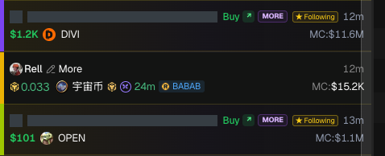
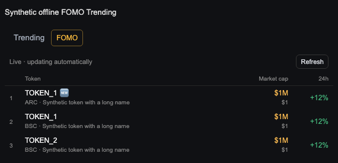
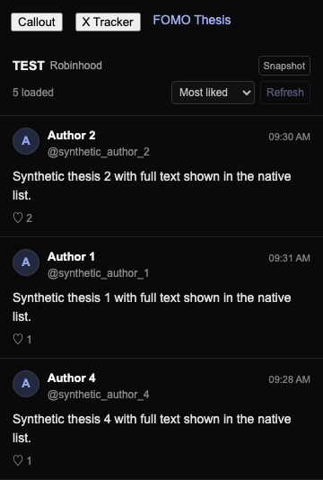
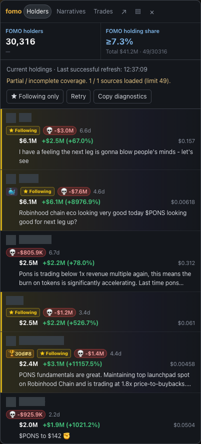
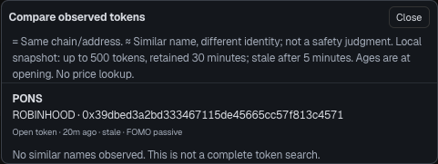
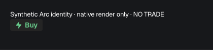

# GMGN FOMO Helper

FOMO activity, token context and trading tools inside GMGN.

Version **0.53.35** · [Download](https://github.com/d3wlt/gmgn-fomo-helper/releases) · [Install / update](GUIDE.md#install-and-update) · [Privacy](PRIVACY.md)

## Features

### One GMGN + FOMO tracker

- GMGN and FOMO Following activity in one chronological feed, with one scrollbar.
- Card and table layouts, readable trader names and inline thesis text.
- Wallet activity follows GMGN’s chain selector. Keep a signed-in FOMO tab open to receive Following activity.

### FOMO Trending

- Live rankings, market cap, price and 24-hour change inside GMGN’s Trending panel.
- Holds the list still while you hover or scroll.
- All supported chains, independent of the chain selector; 🆕 marks newly observed entries for 10 seconds—not initial loads or reconnects.

*Current-source browser test with sample tokens.*

### Community FOMO Thesis

- A token-specific feed beside **Callout** and **X Tracker**, independent of chart bubbles.
- Full posts, author names, timestamps and read-only likes.
- Sort by **Newest first**, **Oldest first** or **Most liked**. Sorts loaded posts only; up to 200 retained, not complete history.

*Current-source browser test with sample posts; screenshot shows the first three loaded rows.*

### Token context

- Holders, narratives and trades for the open token.
- **👥 holder count** shows holders among people you follow; hover for names.
- Buy/sell labels and local English narrative translation where supported. Holder-based history is a limited sample, not a complete trading record.

### Token comparison

- **=** marks the same chain and contract; **≈** marks similar observed names.
- **Compare** opens a side-by-side identity check using already observed data—not a safety rating or an exhaustive token search.

### Native QuickBuy

- GMGN’s native buy control on FOMO tracker cards, including Robinhood and Arc.
- Uses native Following wallet and amount settings; Arc uses USDC. Availability depends on GMGN’s supported wallet context.

*Render-only verification—not a completed trade. Clicking QuickBuy can execute a real trade; the helper does not trade automatically.*

### More tools

- Developer-wallet highlighting, saved developers and launch-performance stats.
- Position-surge alerts and notification history.
- Callout-account blocking and optional hiding of the third-party Lightning Trade button.

---

[Setup, limitations and troubleshooting](GUIDE.md) · [Development](GUIDE.md#development-and-releases) · [Changelog](CHANGELOG.md)

Based on [better gmgn](https://github.com/0xuezhang985/985gmgn-helper) by [0xuezhang985](https://github.com/0xuezhang985) and contributors. Independent fork; not affiliated with GMGN or FOMO.
